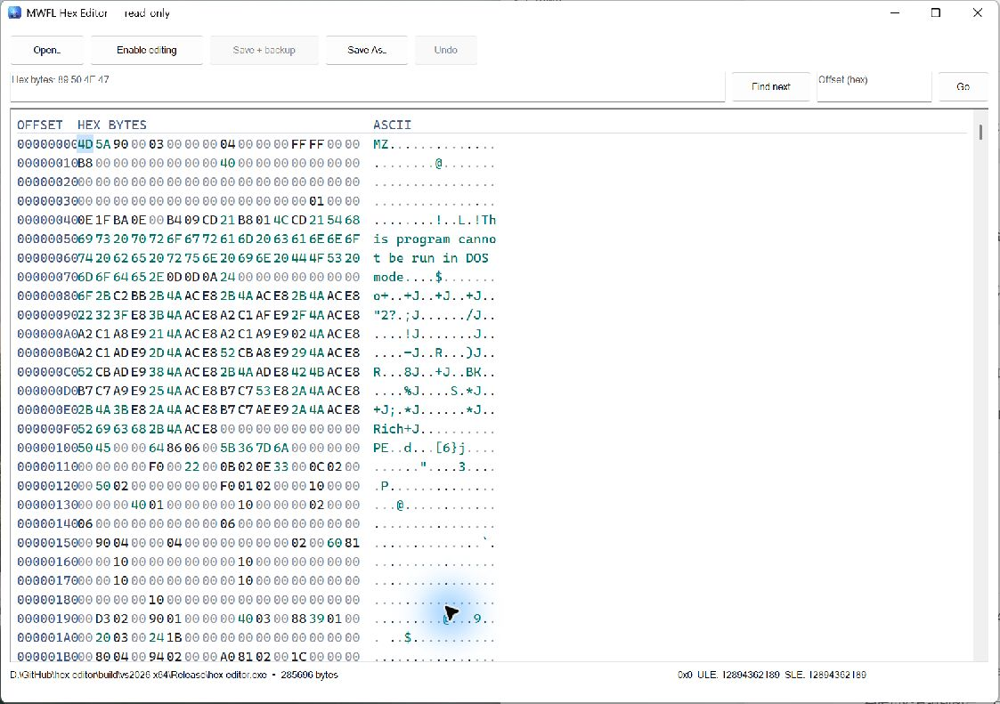

# MWFL Hex Editor

[](https://github.com/mwfl/hex-editor/actions/workflows/ci.yml)

MWFL Hex Editor is a safety-focused native Windows binary editor. It opens every
file read-only, presents synchronized offset, hexadecimal, and ASCII columns,
and makes editing an explicit overwrite-only mode.



## Features

- Open arbitrary files up to 256 MiB; no file type assumptions.
- Read-only by default with a prominent, confirmed edit-mode transition.
- Native custom-drawn virtual hex surface; only visible rows are painted.
- Synchronized hexadecimal and ASCII columns with byte selection.
- Changed-byte highlighting in coordinated Light and Dark Mode palettes.
- Keyboard navigation, direct nibble overwrite, undo, offset jump, and hex search.
- Scroll-bar navigation across the complete bounded document; rendering remains virtual.
- Little-endian unsigned and signed interpretation at the selected offset.
- **Save As** for a new file without touching the source.
- Original-file save uses an atomic sibling temporary, detects external changes,
  requires confirmation, and creates a `.bak` copy through `ReplaceFileW`.
- Drag and drop plus direct `hex-editor.exe "C:\path\file.bin"` opening.

The application intentionally does not edit disks, process memory, or resize a
file. Those capabilities have different privilege and corruption risks and do
not belong in a compact MWFL example.

## Build

```powershell
cmake --preset vs2026-x64
cmake --build --preset vs2026-x64-release
ctest --preset vs2026-x64-release
```

Visual Studio 2026 with its MSVC C++20 toolchain is the supported build
environment. The preset uses a neighboring MWFL checkout for development; set
`HEX_EDITOR_USE_LOCAL_MWFL=OFF` to fetch pinned MWFL v0.1.2. The portable package
has no installer.

## Editing safety

Opening and navigation never modify the source. Enabling editing only changes
the in-memory document. Prefer **Save As** while experimenting. **Save + backup**
replaces the original only after a complete temporary file is written and asks
Windows to retain the prior content as `<name>.bak`. If the source changed after
opening, original-file save is rejected.
